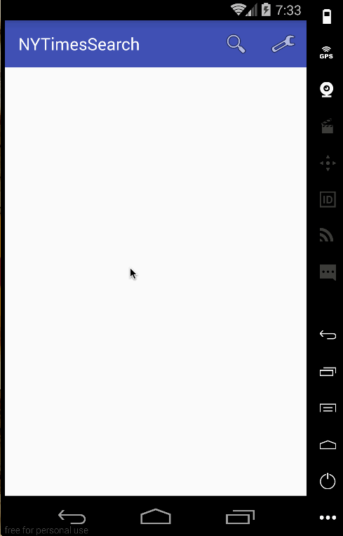

# Project 2 - NYTimesSearch

NYTimesSearch is an android app that allows a user to search for articles on web using simple filters. The app utilizes New York Times Search API.

Time spent: **20** hours

## User Stories

Completed user stories:

* [x] Required: User can enter a search query that will display a grid of news articles using the thumbnail and headline from the New York Times Search API.
* [x] Required: User enters the query into a SearchView or custom layout within the app bar.
* [x] Required: User can click on "settings" which allows selection of advanced search options to filter results.
* [x] Required: Use Parcelable to pass settings instead of Serializable using the popular Parceler library.
* [x] Required: User can configure advanced search filters such as:
* [x] Required: Begin Date (using a date picker)
* [x] Required: News desk values (Arts, Fashion & Style, Sports)
* [x] Required: Sort order (oldest or newest)
* [x] Required: Subsequent searches will have any filters applied to the search results.
* [x] Required: User can tap on any article in results to view the contents in an embedded browser.
* [x] Required: User can scroll down "infinitely" to continue loading more news articles. The maximum number of articles is limited by the API search.
* [x] Required: User can share a link to their friends or email it to themselves.

## Video Walkthrough

Here's a walkthrough of implemented user stories:

GIF created with [LiceCap](http://www.cockos.com/licecap/).

## License

    Copyright 2016 Larry Kai

    Licensed under the Apache License, Version 2.0 (the "License");
    you may not use this file except in compliance with the License.
    You may obtain a copy of the License at

        http://www.apache.org/licenses/LICENSE-2.0

    Unless required by applicable law or agreed to in writing, software
    distributed under the License is distributed on an "AS IS" BASIS,
    WITHOUT WARRANTIES OR CONDITIONS OF ANY KIND, either express or implied.
    See the License for the specific language governing permissions and
    limitations under the License.
